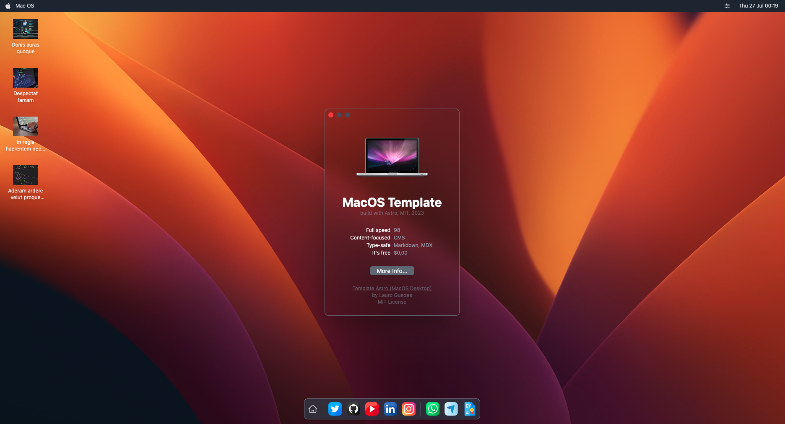

# MacOS Desktop Template Astro



This is an open-source project template built with Astro framework. It was created to help developers create your own portfolio page. It is a simple and clean template that can be easily customized.

~~This theme is self-documented \_ which means articles/posts in this theme can also be considered as documentations.~~

I inspired in the MacOS Desktop interface to create this template. I hope you enjoy it.

## 💻 Tech Stack

- [x] Astro
- [x] Tailwind CSS
- [x] Vue JS
- [x] Heroicons
- [x] Headless UI

## 🚀 Features

- [x] Markdown & MDX support
- [x] SEO-friendly with canonical URLs and OpenGraph data
- [x] Highly customizable
- [ ] Sitemap support
- [ ] RSS Feed support
- [ ] Responsive (mobile ~ desktops)
- [ ] Light & dark mode
- [ ] Fuzzy search

## 📂 Project Structure

Inside of your MacOS Desktop Template Astro project, you'll see the following folders and files:

```
/
├── public/
├── src/
│   ├── components/
│   ├── layouts/
│   ├── images/
│   ├── assets/
│   ├── scripts/
│   └── pages/
│       ├── posts/
│       │   ├── ...
│       ├── tags/
│       │   ├── [tag].astro
│       │   ├── index.astro
│       └── index.astro
|       └── rss.xml.js
└── package.json
└── astro.config.mjs
└── README.md
└── tailwind.config.js
└── tsconfig.json
```

Astro looks for `.astro` or `.md` files in the `src/pages/` directory. Each page is exposed as a route based on its file name.

There's nothing special about `src/components/`, but that's where we like to put any Astro/React/Vue/Svelte/Preact components.

Any static assets, like images, can be placed in the `public/` directory.

## 🧞 Commands

All commands are run from the root of the project, from a terminal:

| Command                | Action                                           |
| :--------------------- | :----------------------------------------------- |
| `npm install`          | Installs dependencies                            |
| `npm run dev`          | Starts local dev server at `localhost:3000`      |
| `npm run build`        | Build your production site to `./dist/`          |
| `npm run preview`      | Preview your build locally, before deploying     |
| `npm run astro ...`    | Run CLI commands like `astro add`, `astro check` |
| `npm run astro --help` | Get help using the Astro CLI                     |

## 👀 Want to learn more?

Feel free to check [Astro documentation](https://docs.astro.build) or jump into Astro [Discord server](https://astro.build/chat).

If you have any suggestions/feedback, you can contact me via [my email](mailto:laurowguedes@gmail.com). Alternatively, you can open an issue on GitHub.

## 📝 License

This project is licensed under the MIT License, Copyright © 2023.

--

Made with 💙 by [Lauro Guedes](https://leowgweb.com.br) 🧑🏼‍🚀
